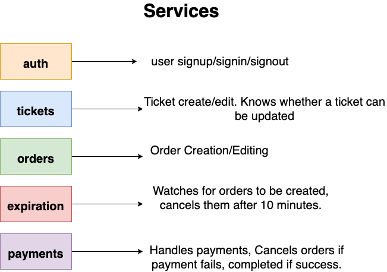
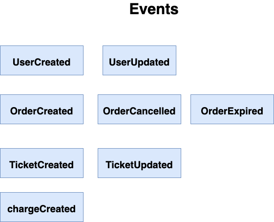
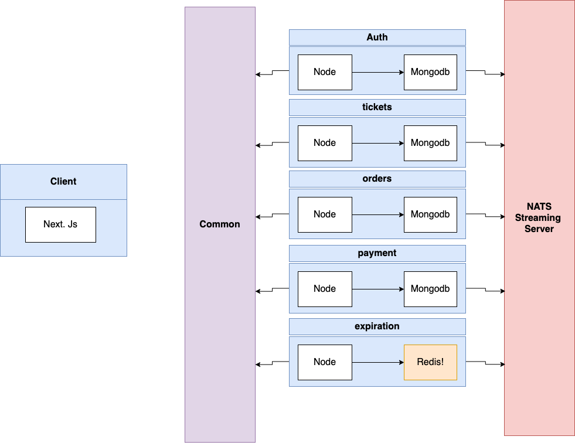

# Database Schema

## User

|   Name   |   Type   |
| :------: | :------: |
|  email   | `string` |
| password | `string` |

## Order

|  Name   |                        Type                         |
| :-----: | :-------------------------------------------------: |
| userId  |                    `Ref to User`                    |
| status  | `Created - Cancelled - AwaitingPayment - Completed` |
| userId  |                    `Ref to User`                    |
| orderId |                   `Ref to Order`                    |

## Ticket

|  Name   |      Type      |
| :-----: | :------------: |
|  title  |    `string`    |
|  price  |    `number`    |
| userId  | `Ref to User`  |
| orderId | `Ref to Order` |

## Charge

|      Name      |              Type              |
| :------------: | :----------------------------: |
|    orderId     |         `Ref to Order`         |
|     status     | `Created - Failed - Completed` |
|     amount     |            `number`            |
|    stripeId    |            `string`            |
| stripeRefundId |            `string`            |

# Services

# Events

# architecture

